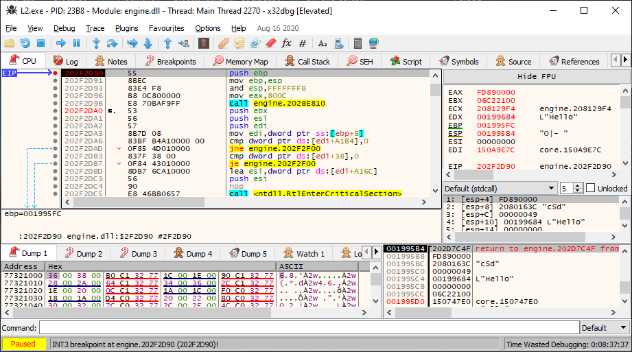
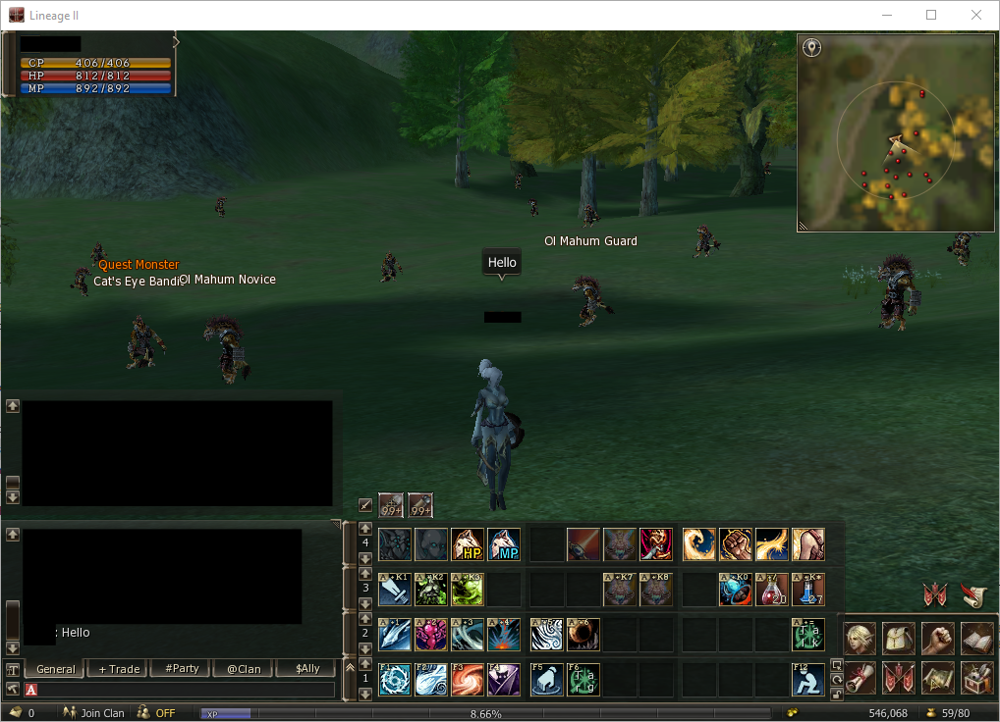
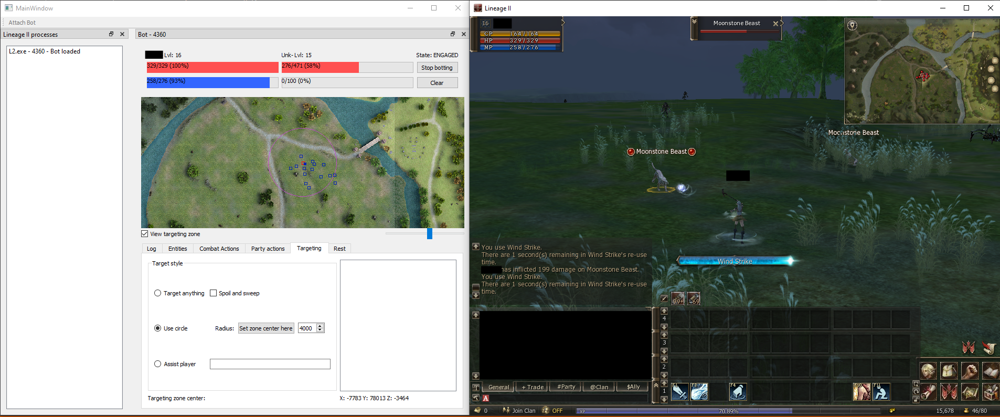

# Создание внутриигрового бота Lineage 2

Все работающие и доступные боты платные (насколько мне известно), и большинство из них обнаруживаются удаленными серверами как мошеннические инструменты!

Поэтому я решил сделать своего собственного бота, так как думал, что процесс будет интересным. В этом сообщении в блоге представлен мой подход к созданию собственного бота для Lineage II.

### Предыстория

Поскольку для этого требуется много фарма, возможность автоматизировать действие по убийству монстров очень помогает игроку. Можно позволить своему персонажу заниматься фармом ночью, а играть днем ​​и получать множество наград.

Разработанный мной бот сможет нацеливаться на ближайшего монстра, атаковать его и использовать заклинания, подбирать предметы и отдыхать, когда это необходимо.

Lineage II защищена (вероятно, старой) версией WinLicense, поэтому некоторые функции в исполняемом файле могут быть виртуализированы, но нам это не будет иметь никакого значения. Кроме того, игровые серверы используют такие средства защиты, как GameGuard, SmartGuard или LameGuard, для предотвращения ботов, и по какой-то причине мой бот вообще не обнаруживается ни одним сервером, к которому я подключался.

В Lineage II есть много эмуляторов общедоступных частных серверов и различные исследования по взлому пакетов, поэтому общая задача не была очень сложной, поскольку в Интернете доступно множество ресурсов.

### Делаем бота
## Выбор дизайна
Я вижу два разных типа ботов. Полноценные внеигровые (OOG) боты и внутриигровые боты (IG).

Сложность создания бота OOG заключается в том, что для этого требуется реинжиниринг, понимание и реализация всего протокола клиент-сервер (включая сетевое шифрование). Однако это может быть весьма полезным, поскольку тогда можно запустить бота без копии игры. Это означает, что будет намного легче и проще запускать несколько экземпляров бота.

В случае с Lineage II сделать IG-бота намного проще, так как Lineage II реализована таким образом, что клиент не будет предсказывать никаких действий, а только будет реагировать на то, что отправляет сервер. Это означает, что мы можем имитировать отправку пакета с помощью запущенного клиента, и это все, игровой клиент будет реагировать на этот пакет, который мы отправили, после того, как сервер подтвердит (или нет) действие. Однако запуск IG-бота может быть утомительным, поскольку он будет немного навязчивым и может вызвать обнаружение анти-читов.

Я решил пойти с ботом IG, так как Lineage II — старая игра, и я подозревал, что если бы в ней был какой-нибудь анти-чит, обойти его было бы несложно.

### Отправка определенного пакета

## Поиск функции отправки пакета

Поскольку моей целью была автоматизация вещей, моей первой задачей было отправить выбранный пакет, чтобы я мог автоматизировать отдельные задачи.

Lineage II работает по протоколу TCP и сначала подключается к серверу входа, который объединяет несколько игровых серверов. Следующие шаги описывают отправку пакета, когда он уже находится в игре и подключен к игровому серверу.

Для того, чтобы отправить пакет, мне нужно было найти функцию, которая отправит пакет. В игре используются функции sendиз родной библиотеки Windows ws2_32.dll. Все, что мне нужно было сделать, это установить там точку останова и выполнить действие в игре, чтобы вызвать ее. Параметры, переданные sendфункции, содержат зашифрованный пакет, поэтому нам нужно проверить, откуда sendвызывается функция, благодаря кадру стека. Оттуда можно сделать небольшой реверс-инжиниринг и понять, что происходит.

На скриншоте выше показан вызов функции отправки пакета, когда я набираю сообщение для отправки в игровой чат. Первое значение в кадре стека — это адрес возврата, а следующие — аргументы функции. Первый аргумент — это фиксированный указатель на некоторую структуру данных, содержащую сокет Windows TCP. Второй аргумент представляет собой завершающуюся нулем строку, в которой каждый символ указывает тип поля пакета. В нашем случае (отправка сообщения в чат) пакет содержит следующие аргументы:

- "c" ( char): 0x49что соответствует идентификатору пакета "отправить сообщение",
- "S" ( String): L"Hello"указатель на широкую строку с нулевым завершением,
- "d" ( dword): 0x00000000что соответствует идентификатору канала.

##Воспроизведение пакета

Для вызова функции "отправить пакет" я решил внедрить в игровой процесс DLL, которая бы создавала поток и вызывала эту самую функцию.

Код DLL довольно мал:

`DWORD SendPacketFP;
DWORD(_stdcall* sendPacket)(DWORD FP, const char* format, ...);

#define DATA_SEND_ADDR 0x3E3B80          // Offset of the "send packet" function in engine.dll
#define DATA_SEND_SOCKET_INFO 0xFD890000 // Offset of the networking structure

void ProcessAttach()
{
    DWORD EngineDLLBase = (DWORD) GetModuleHandle(L"engine.dll");

    sendPacket = (DWORD(_stdcall *)(DWORD, const char*, ...)) EngineDLLBase + DATA_SEND_ADDR;
    SendPacketFP = DATA_SEND_SOCKET_INFO; // Pointer to the network structure

    const char format[] = "cSd";
    const WCHAR* message = L"Hello";

    DWORD parameters[3] = { 0 };
    parameters[0] = 0x49;                 // Packet ID
    parameters[1] = (DWORD) message;      // Pointer to our message
    parameters[2] = 0x00000000;           // General chat ID

    sendPacket(SendPacketFP, format, parameters[0], parameters[1], parameters[2]);
}

BOOL APIENTRY DllMain( HMODULE hModule,
                       DWORD  ul_reason_for_call,
                       LPVOID lpReserved
                     )
{
    switch (ul_reason_for_call)
    {
    case DLL_PROCESS_ATTACH:
        CreateThread(NULL, 0, (LPTHREAD_START_ROUTINE)ProcessAttach, 0, 0, NULL);
        break;
    case DLL_THREAD_ATTACH:
    case DLL_THREAD_DETACH:
    case DLL_PROCESS_DETACH:
        break;
    }
    return TRUE;
}`

Есть несколько способов внедрить DLL в игровой процесс. Я решил сделать свой собственный инжектор, который очень прост и будет:

- OpenProcessигровой процессl2.exe
- Выделить память в адресном пространстве игрового процесса с помощьюVirtualAllocEx
- Напишите .dllполный путь WriteProcessMemoryв это пространство
- Загрузите библиотеку, с CreateRemoteThreadкоторой будет вызыватьсяLoadLibraryW

Теперь, когда я загружаю библиотеку, на сервер отправляется пакет, и мы можем наблюдать результат прямо в игре.

Это круто, теперь я могу совершать действия в игре, но мне также нужно получать информацию из окружающей среды.

##Получение инсайтов из игры

Чтобы бот работал, необходимо собирать информацию из игры, такую ​​как текущая позиция игрока, здоровье, инвентарь, навыки, а также близлежащие объекты, такие как неигровые персонажи (NPC), или близлежащие игроки или монстры.

Для этого я вижу только два пути: либо инспектировать игровую память, что предполагает нахождение положения всех этих структур в виртуальном адресном пространстве игры, либо просто парсить полученные пакеты с сервера, как это делает игровой клиент. Я решил пойти по второму пути, так как думал, что будет сложно надежно собрать всю необходимую мне информацию, просто проверив память. Однако в долгосрочной перспективе это могло быть проще, поскольку не было необходимости понимать протокол клиент-сервер.

Аналогично тому, что я делал ранее, можно поставить точку останова на recvфункцию из ws2_32.dllи проверить кадр стека и попытаться определить, какая функция вызывает recv. После этого мы можем попытаться пройти через каждую функцию, пока пакет не будет расшифрован, и мы сможем начать его разбор.

Чтобы уведомить моего бота о получении пакета, необходимо подключить функцию «получить пакет», чтобы я мог сбросить пакеты, а затем вернуть поток выполнения в игру.

`LPVOID Hook(LPVOID functionToHook, LPVOID myFunction, size_t size)
{
    DWORD old;
    DWORD old2;

    // Allocate memory and copy the old bytes (original instructions) there
    oldInstructions = malloc(5 + size);
    VirtualProtect(oldInstructions, size + 5, PAGE_EXECUTE_READWRITE, &old);
    memcpy(oldInstructions, functionToHook, size);

    // Add a jump after the copied bytes from the hooked function
    // to jump back to the rest of that hooked function.
    // This allows that when someone calls oldInstructions, it acts as the original functionToHook
    *(BYTE*)((DWORD)oldInstructions + size) = 0xE9;
    *(DWORD*)((DWORD)oldInstructions + size + 1) = (DWORD)((DWORD)functionToHook + size) - (DWORD)((DWORD)oldInstructions + size) - 5;

    // Patch the function to hook in order to jump to our own function
    VirtualProtect(functionToHook, 5, PAGE_EXECUTE_READWRITE, &old);
    *(BYTE*)functionToHook = 0xE9;
    *(DWORD*)((DWORD)functionToHook + 1) = (DWORD)myFunction - (DWORD)functionToHook - 5;
    VirtualProtect(functionToHook, 5, old, &old2);
    return oldInstructions;
}`

В приведенной выше функции вам может быть интересно 5, что относится к длине инструкции jmp.

Для того, чтобы понять пакеты и их значение, в Интернете есть множество ресурсов, описывающих пакеты почти для каждой версии Lineage II, поэтому задача обратного проектирования здесь почти не существует.

###Архитектура бота

##Дизайн программного обеспечения

Например, вы можете достичь Start состояния с очень низким уровнем здоровья, и вы не хотите, чтобы ваш персонаж начал бить монстров с низким уровнем здоровья (ОЗ), поэтому предпочтительнее перейти кRestсостояние. Также вы должны иметь в виду, что ничто не происходит мгновенно, поэтому многие проверки должны выполняться очень часто. Выбирая монстра для атаки и атакуя его, обычно, когда вы играете по-настоящему, вы не хотите атаковать монстра, который уже атакован игроком. Чтобы имитировать такое поведение, важно проверять в нескольких состояниях, действительна ли текущая цель. Также важно продумать каждый уголок дела. Бот может выбрать монстра, который уже был застрелен другим игроком к моменту прицеливания, и вы не хотите , чтобы бот был заблокирован в таком случае, поэтому я выбрал Choosing, Target, и .TargetedEngageEngaged

Таким образом, каждое состояние будет иметь свой собственный набор проверок и выполнять действие только в том случае, если каждая проверка успешно пройдена, в противном случае оно вернется к Start.

При получении какого-либо события, например системных сообщений, таких как "Cannot see target" или "Invalid target", я решил просто проверить, в каком состоянии находятся автоматы, и отреагировать соответствующим образом.

###Полученные результаты

В конце концов, бот работает хорошо и не обнаруживается ни одним сервером, который я пробовал, даже после нескольких часов фарма. Мне удалось запустить 4 экземпляра одновременно на одном компьютере и на одном сервере в течение нескольких часов без каких-либо хлопот, в то время как я знаю, что другие инструменты для ботов обнаруживаются немедленно. Это позволяет мне думать, что каждая «анти-ботовая» система, которую можно приобрести в Интернете, на самом деле только проверяет наличие известных ботов или сигнатур и даже не пытается проводить «расширенный» анализ.

Я знаю, что некоторые серверы более сложны и запрашивают капчу через определенное время, но я думаю, что это индивидуальная «самодельная» защита, которая может немного раздражать игроков, но усложняет задачу для тех, кто использует бота для победы (хотя я нашел несколько работающих внутриигровых реализаций взлома капчи в Интернете).

Вот и все, в конце концов, бота было довольно просто построить, и я доволен результатами, хотя еще многое предстоит сделать. Однако я боюсь, что моя ностальгия прошла и что я не буду много работать над этим маленьким проектом.

Есть еще много вещей, которые нужно улучшить для бота, и если вы заинтересованы, вы можете проверить это в следующем разделе.

### Идти дальше

Текущий бот позволяет что-то работать, но никто не любит глупых ботов, поэтому ниже приведены некоторые функции, которые, по моему мнению, было бы неплохо иметь, чтобы бота можно было использовать в любой ситуации:

- Добавлено автоматическое определение версии Lineage 2 и правильная поддержка нескольких версий протокола.
- Поддержка автоматической функции порчи и развертки
- Поддержите селф-бафф
- Бафф группы поддержки
- Использование вспомогательных предметов (зелья, свитки, ...)
- Добавить условия для использования предметов/баффов/навыков
- Автоматически анализировать игровые данные, чтобы получать и отображать значки предметов, навыков, имен NPC и т. д.

Забавный факт: .datфайлы Lineage 2 зашифрованы с помощью RSA, что означает, что клиент может расшифровать их с помощью открытого ключа, и только издатель игры может создать действительный файл .dat(при условии, что ключ RSA не слишком слаб).
В основном это подпись, однако это грязно смешно, что они просто проверяют, является ли результат расшифровки допустимым форматом файла.

Вот и все, не стесняйтесь обращаться ко мне, если у вас есть какие-либо вопросы, я надеюсь, вам понравилось!